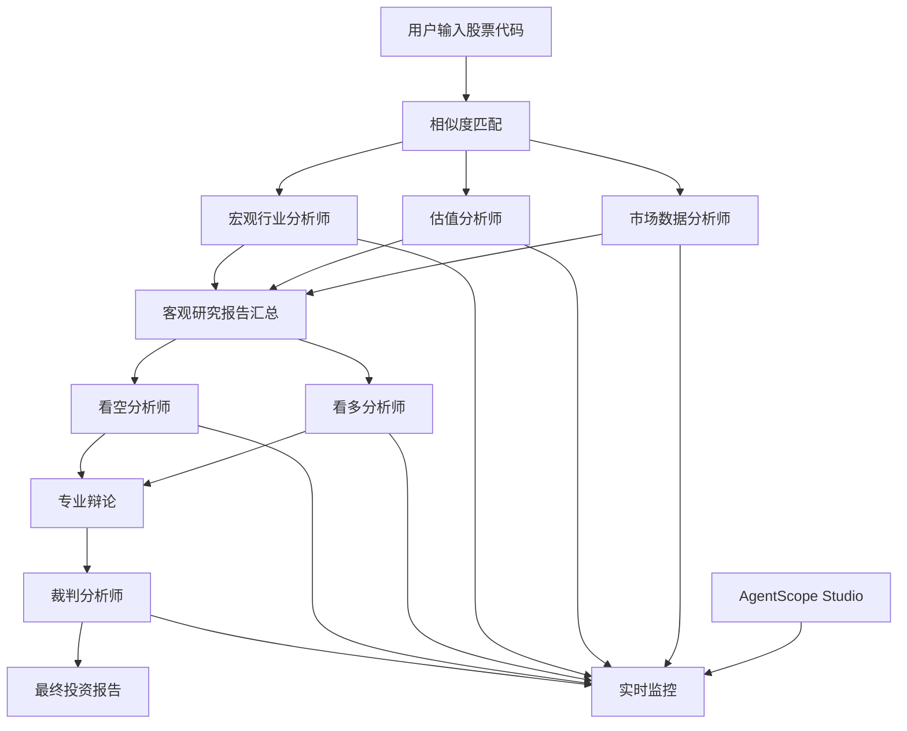

# 🎓 多智能体系统学习项目 - 智能投顾系统

[](https://opensource.org/licenses/MIT)
[](https://www.python.org/downloads/)
[](https://github.com/modelscope/agentscope)
[](#)

> 📚 **这是一个学习多智能体系统构建的演示项目**，旨在展示如何使用AgentScope框架构建复杂的多智能体协作系统。项目以智能投顾为应用场景，演示了多智能体系统的设计理念、协作机制和实现方法。

## 🎯 学习目标

通过本项目，您将学习到：

- 🏗️ **多智能体架构设计**: 如何设计合理的智能体分工协作体系
- 🤝 **智能体协作机制**: 智能体间如何有效沟通和协调工作
- 🔄 **对立思辨系统**: 如何通过辩论机制提升分析的全面性
- 🧠 **技能框架设计**: 如何为智能体定义专业化的技能和知识
- 📊 **工作流编排**: 如何管理和控制复杂的多步骤工作流程
- 🛠️ **AgentScope实践**: 深入理解AgentScope框架的核心概念和用法

虽然以股票投资分析为演示场景，但本项目的设计模式和实现方法可扩展到其他需要多智能体协作的复杂任务场景。

## ✨ 核心特色

- 🧠 **多智能体协作**: 5个专业化AI分析师协同工作，覆盖市场、估值、宏观、辩论和决策全流程
- 📊 **专业分析框架**: 基于成熟金融理论的技术分析、基本面分析、杜邦分析法等
- 🔄 **对立思辨机制**: 通过看多/看空双方的专业辩论，确保分析的全面性和客观性
- ⚖️ **智能裁判系统**: 基于证据和逻辑的投资决策，避免情绪化偏见
- 🌐 **实时数据获取**: 集成多种数据源，获取最新的市场信息和财务数据
- 📈 **可视化监控**: 基于AgentScope Studio提供可视化前端与实时工作流监控

## 🏗️ 系统架构



## 👥 智能体团队

### 🔍 Research Agents (研究团队)

| 智能体 | 专业领域 | 分析重点 |
|--------|----------|----------|
| **market_agent** | 市场技术分析 | 技术指标、市场情绪、估值分位数、消息面分析 |
| **eval_agent** | 基本面分析 | 财务报表、杜邦分析、估值模型、长期趋势预测 |
| **macro_and_industry_agent** | 宏观行业分析 | PESTEL分析、行业生命周期、竞争格局、政策影响 |

### 💬 Debate Agents (辩论团队)

| 智能体 | 角色定位 | 论证策略 |
|--------|----------|----------|
| **bullish_agent** | 看多方分析师 | 成长性、护城河、市场机会、估值支撑 |
| **bearish_agent** | 看空方分析师 | 风险因素、估值泡沫、竞争威胁、财务风险 |

### ⚖️ Decision Agent (决策团队)

| 智能体 | 职责 | 决策依据 |
|--------|------|----------|
| **judge_agent** | 投资裁判 | 证据验证、逻辑评估、概率加权、风险调整 |

## 🚀 快速开始

### 环境要求

- Python 3.8+
- AgentScope Studio （作为前端与可视化监控）

### 安装步骤

1. **克隆项目**
```bash
git clone https://github.com/your-username/intelligent-investment-advisor.git
cd intelligent-investment-advisor
```

2. **安装依赖**（推荐使用uv创建该系统使用的虚拟环境）
```bash
# 创建虚拟环境
uv .venv
# 激活虚拟环境
.venv/Scripts/activate
# 安装依赖
uv pip install -r requirements.txt
# 安装agentscope studio
npm install -g @agentscope/studio
```

3. **配置API密钥**
```bash
cp .env.example .env
# 编辑 .env 文件，填入您的API密钥
```

4. **启动AgentScope Studio** 
```bash
# 在新终端中运行
as_studio
```

5. **运行系统**
```bash
python main.py
```

### 使用示例

```python
# 输入股票代码开始分析
# 系统将自动：
# 1. 匹配相似股票进行对比分析
# 2. 生成三个专业研究报告
# 3. 进行看多/看空辩论
# 4. 生成最终投资决策报告
```

## 📁 项目结构

```
intelligent-investment-advisor/
├── README.md                    # 项目说明文档
├── requirements.txt             # Python依赖包
├── .env.example                # 环境变量模板
├── main.py                     # 主程序入口
├── prompts.py                  # 智能体提示词配置
├── chat_model.py               # 聊天模型配置
├── react_search_agent.py       # ReAct搜索智能体
├── debate_agent.py             # 辩论智能体
├── judge_agent.py              # 裁判智能体
├── market.py                   # 市场数据处理
├── eval.py                     # 估值分析模块
├── dupont.py                   # 杜邦分析模块
├── input_processing.py         # 输入处理模块
├── stock_list.csv              # 股票列表数据
├── similarity/                 # 股票相似度匹配模块
│   ├── similarity.py
│   ├── training.py
│   └── stock_similarity_model/
├── survey skill/               # 研究分析技能框架
├── debate skill/               # 辩论技能框架
├── judge skill/                # 裁判技能框架
├── report/                     # 生成的分析报告
└── studio_logs/                # AgentScope Studio日志
```

## 🔧 配置说明

### API密钥配置

在 `.env` 文件中配置以下API密钥：

```env
TUSHARE_API_KEY='your_tushare_api_key'
DEEPSEEK_API_KEY='your_deepseek_api_key'
DASHSCOPE_API_KEY='your_dashscope_api_key'
```
> 本模型使用Tushare API 获取股票数据
> 使用DeepSeek 作为智能体的LLM服务提供方，若需要使用其他LLM服务，请自行修改`chat_model.py`
> 使用DashScope 提供的通义 Web-Search MCP 服务作为搜索引擎，若需要使用其他搜索引擎，请自行修改`react_search_agent.py`,`debate_agent.py`

### AgentScope Studio配置

系统默认连接到本地AgentScope Studio：
- 地址: `http://localhost:3000`
- 可在 `main.py` 中修改 `studio_url` 参数

## 📊 分析报告示例

系统会为每只股票生成完整的分析报告，包括：

1. **市场数据报告** - 技术分析和短期趋势
2. **估值分析报告** - 基本面和长期价值评估  
3. **宏观行业报告** - 行业环境和政策影响
4. **最终投资报告** - 综合决策和投资建议

查看 `report/` 目录下的示例报告。

## 🛠️ 自定义扩展

### 添加新的智能体

1. 继承 `ReActAgent` 基类
2. 定义专业的提示词
3. 注册相应的技能框架
4. 集成到主工作流中

### 自定义技能框架

在对应的 `skill/` 目录下创建 `SKILL.md` 文件，定义专业的分析方法和流程。

## 📄 许可证

本项目采用 [MIT 许可证](LICENSE)。

⚠️ **免责声明**: 本系统提供的分析报告仅供参考，不构成投资建议。投资有风险，入市需谨慎。

## Todo

- [] 股票相似度匹配模型【现有的相似度模型效果欠佳，将尝试更换模型底座为其他embedding模型，并丰富训练模型使用的数据】
- [] 优化各智能体的prompt, agent skill等描述，进一步完善工作流程
- [] 添加更多智能体，如：本地股票研究报告分析智能体……
